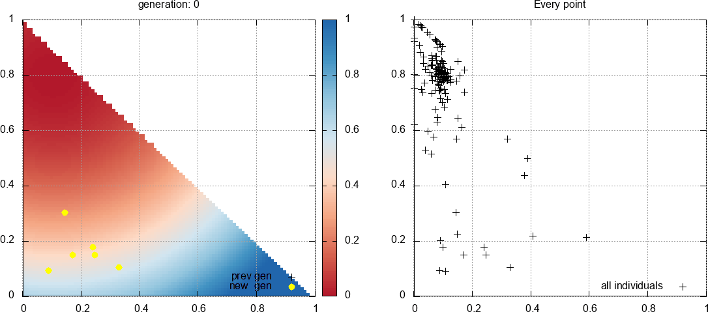

# Policy-based optimization

PBO (policy-based optimization) is a degenerate policy gradient algorithm used for black-box optimization. It shares common traits with both DRL (deep reinforcement learning) policy gradient methods, and ES (evolution strategies) techniques. In this repository, we present a parallel PBO algorithm with full covariance matrix adaptation, along with a few demonstrative applications. The related pre-print can be found <a href="https://arxiv.org/abs/2104.06175">here</a>. This paper formalizes the approach used in previous related works:

- Direct shape optimization through deep reinforcement learning (<a href="https://www.sciencedirect.com/science/article/pii/S0021999120308548">paper</a>, <a href="https://arxiv.org/pdf/1908.09885.pdf">pre-print</a> and <a href="https://github.com/jviquerat/drl_shape_optimization">github repository</a>),
- Single-step deep reinforcement learning for open-loop control of laminar and turbulent flows (<a href="https://journals.aps.org/prfluids/abstract/10.1103/PhysRevFluids.6.053902">paper</a> and <a href="https://arxiv.org/pdf/2006.02979.pdf">pre-print</a>),
- Deep reinforcement learning for the control of conjugate heat transfer with application to workpiece cooling (<a href="https://www.sciencedirect.com/science/article/pii/S0021999121002126">paper</a> and <a href="https://arxiv.org/pdf/2011.15035.pdf">pre-print</a>)

## Installation and usage

After cloning the package, just `cd` inside the folder and install using:

```
pip install -e .
```

The environments from the paper are available in the `envs/*` folder. For each `.py` environment file, you need a `.json` parameter file **located in the same directory**. To run an environment, just use:

```
pbo path/to/envs/my_env.json
```

Below are some selected optimization cases performed with the algorithm.

## Function minimization

Simple minimum-finding on textbook analytical functions (see more in the paper).

### Parabola function

We consider the minimization on a parabola defined in `[-5,5]x[-5,5]`. Below is the course of a single run, generation after generation, with a starting point in `[2.5,2.5]`:

<p align="center">
  
</p>

### Rosenbrock function

The Rosenbrock function is here defined in `[-2,2]x[-2,2]`. It contains a very narrow valley, with a minimum in `[1,1]`. The shape of the valley makes it a hard optimization problem for many algorithms. Here is the course of a single run, generation after generation, with a starting point in `[0.0,-1.0]`:

<p align="center">
  
</p>

### Parabola function on triangular domain

To test the case of dependant variables, we consider a parabola function on a triangular domain, with `x` in `[0,1]` and `y` in `[0,1-x]`. The parabola has its minimum in `[0.1,0.8]`, while the starting point is located in `[0.2,0.2]`:

<p align="center">
  
</p>

## Packing

Optimal packing of geometrical shapes (see <a href="https://erich-friedman.github.io/packing/index.html">here</a> for much, much more). The goal is to pack unit shapes in another shape of smallest dimension. Most solutions are already known.

|  | **6 circles in square**: the optimal value is `s = 5.328+`, best PBO result was `s = 5.331` after 800 generations. |
|  | **10 circles in square**: the optimal value is `s = 6.747+`, best PBO result was `s = 6.754` after 1000 generations |

### 6 circles in a square

The goal is to pack 6 circles in the square of smallest side (hence 12 degrees of freedom). The solution is obviously known, and the optimal value is `s = 5.328+`. Best PBO result was `s = 5.3315` after 800 generations.

<p align="center">
  
</p>

## Parametric control laws

### Chaotic Lorenz attractor

We consider the equations of the Lorenz attractor with a velocity-based control term:

<p align="center">
  
</p>

We make use of the following non-linear control with four free parameters:

<p align="center">
  
</p>

Two control cases are designed: the first one consists in forcing the system to stay in the x<0 quadrant, while the second one consists in maximizing the number of sign changes (cases inspired from <a href="https://research.tue.nl/files/146730787/Beintema_afstudeerverslag.pdf">this thesis</a>). Below is a comparison between the two controlled cases.

<p align="center">
  
  
</p>

### Cartpole

Visuals to do
